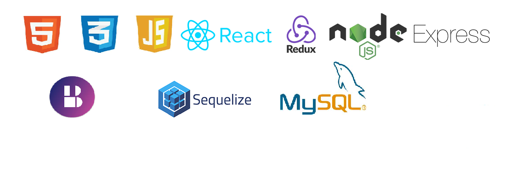

<h1 align="center">Hola Mundo!! 👋 me llamo Nestor Novella.</h1>

<h3>Actualmente soy estudiante del BootCamp Soy Henry🧑‍🚀, en estos últimos 6 meses he mejorado mucho mis habilidades en la programación.
    Aprendí a crear paginas y aplicaciones web, cree un aplicacion de recetas (FOODS), tanto el Front como backEnd, y realice un trabajo grupal que fue la creación de un e-commerce.
</h3>
<h3>
    Me siento bastante seguro de todo lo que logré, y estoy ansioso por seguir mejorando mis habilidades🏋️‍♀️.
</h3>

<h2>Mis Skills:</h2>

<a href="https://www.linkedin.com/in/nestor-novella-1125b3215/">👉Linkedin...👀 💪</a>

